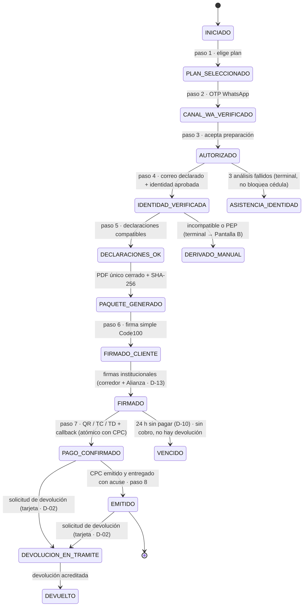
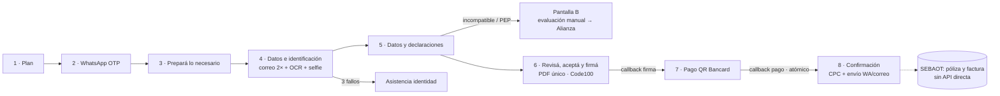

# PLAN DE CAMBIOS v2 — SeguroLoTengo

**Fecha:** 19 de agosto de 2026 · **Base:** reunión Interseguros 18-ago-2026 + PantallasDemo2 + Matriz Legal Final V4 (16-ago-2026)
**Insumo de auditoría:** `docs/auditoria/ESTADO_ACTUAL.md` (Fase 0) · **Decisiones:** `docs/plan/DECISIONES.md` (D-01…D-22)
**Estado (20-ago-2026):** L1 a L5e **cerrados** y las **ocho pantallas reformuladas e implementadas** (§1-bis a), con E2E 7/7; queda **L6**. Ver §1-bis para lo que cambió después de escribirse este plan. Texto original conservado abajo
**Estado original:** BORRADOR PARA APROBACIÓN — nada de este plan se implementa sin la aprobación explícita de Andres, y ninguna parte que dependa de una decisión `PENDIENTE` se implementa antes de que esa decisión esté `DECIDIDA`.

---

## 1. Resumen ejecutivo

**Qué cambia.** El wizard pasa de 9 pasos a **8**: el plan sube al paso 1 y el OTP de WhatsApp al paso 2 (CHG-01); el OTP de correo desaparece como paso (NC-02) y el correo —con doble tipeo— se integra a la pantalla de identidad (CHG-14/17); la **firma se adelanta al paso 6 y el pago pasa al 7** (Matriz V4 §7: el QR de Bancard solo se habilita con firma válida); la Solicitud y el FIPF se consolidan en **un único PDF** con un solo acto de firma (CHG-30); aparece el **Certificado de Cobertura Provisional** como documento nuevo, emitido solo con pago confirmado y enviado automáticamente a WhatsApp y correo (CHG-42/44); los datos fiscales se mudan de declaraciones a pago (CHG-26/34); y la trazabilidad se ensancha a **todos** los clics, descargas, reproducciones y aceptaciones, con IP y versión de texto (TRV-01/CMP-15). Transversales: voseo homogéneo, enlaces a las webs oficiales, disclaimer de marca tras feature flag, barra de plan omnipresente, responsive móvil apilado.

**Qué no cambia (NC-01…NC-08).** Todo lo no listado: arquitectura de puertos y adaptadores, motor de documentos determinista, política de identidad versionada (umbral 99, MRZ, prueba de vida), consola administrativa, panel de demo, asistencia de identidad, reglas de negocio de producto (24 h post-pago, carencias, 18–64, solo titular, pago único anual en guaraníes), firma no cualificada del cliente —cuyo **ejecutor dejó de estar definido**, ver §1-bis— y el disclaimer de Bancard.

**Por qué.** La reunión del 18-ago fija el alcance funcional/UX; la Matriz V4 es la fuente maestra de cumplimiento ("el importante en realidad es la matriz") y su secuencia técnica §7 es la que ordena firma→pago→CPC. Cuatro acuerdos de la reunión chocan con mínimos de la matriz y **no se implementan sin decisión** (ALR-01…ALR-04 → D-01…D-04). El plan además re-basa cinco reglas internas del repo que el código hace imposibles de violar (D-06…D-12): se cambian con registro, no se esquivan.

**Riesgo dominante.** El lote L4 (inversión firma↔pago + PDF unificado) toca la máquina de estados, el servicio de documentos y dos integraciones a la vez; se mitiga con el gate por lote, la batería E2E (7/7 en verde hoy) ampliada antes de tocar, y rollback por revert del merge del lote.

---

## 1-bis. Actualización del 20 de agosto de 2026

Tres hechos posteriores a la redacción de este plan lo modifican. Ninguno
invalida un lote cerrado; los tres cambian lo que sigue.

### a · Reformulación de las pantallas al formato de la maqueta

Por instrucción expresa de Andres, las ocho pantallas se reformulan contra
`docs/antecedentes/PantallasDemo2.pdf`. El detalle vive en
`docs/plan/REFORMULACION_PANTALLAS_MAQUETA.md`, que **manda sobre este plan en
todo lo relativo a formato, campos visibles y textos de pantalla**. Rige además
un **gate nuevo**: la maqueta de cada pantalla se aprueba antes de escribir el
código. Las ocho están aprobadas.

Cuatro puntos donde eso pisa decisiones de este plan:

| Punto del plan | Qué queda |
| :---- | :---- |
| **D-04** (montos de la Matriz V4: 290.000 / 475.000 / 660.000) | **Derogado en montos.** Rigen los de la maqueta: `Gs. 319.000 / 522.500 / 726.000`. Obligó a subir `ID_VERSION_OFERTA` a `OFERTA-CONFIO-v2`. El código de producto y la resolución siguen como marcadores `CDXXXXX`. |
| **CHG-15** (edición con cotejo: solo nombres y apellidos) | **Ampliado a sexo y nacionalidad.** Cerrados quedan **cédula y fecha de nacimiento**, que son de los que cuelgan la regla #8 (edad) y la #11 (bloqueo por cédula). |
| **CMP-01** (identificación regulatoria permanente) | Se muda de franja única al pie de la cabecera a **línea de registro bajo cada entidad**. Sigue visible, legible y permanente. |
| **P0** (pantalla de información previa) | **Eliminada.** La raíz redirige al paso 1, que absorbió las fichas de producto y el video. |

Además: **«no cualificada» sale de todas las pantallas** (pasos 6 y 8) — los
documentos y la evidencia la conservan, que es donde tiene valor probatorio—, y
el pie de información precontractual sale del paso 1.

### b · Code100 no puede recibir la firma del cliente

El proveedor respondió las doce consultas técnicas
(`docs/Integraciones/Code100 - Respuestas C1 a C12.md`, fuente de verdad de la
integración): **Api Flow firma exclusivamente con certificado cualificado que
el firmante ya tenga emitido a su nombre**. El cliente de CONFÍO no lo tiene.

Consecuencias sobre este plan:

- **PEN-01/PEN-02 dejan de estar abiertos por falta de respuesta**: hay
  respuesta, y es un `no` para la firma del cliente. Lo que queda abierto es
  **una decisión de negocio y legal** —cómo firma el cliente— y no una
  dependencia técnica.
- El **modelo de firmantes no cambia**: el cliente firma simple y las
  institucionales cualificadas (D-13). Cambia **quién ejecuta** la firma del
  cliente. La opción recomendada en el informe a la Gerencia es que la resuelva
  SeguroLoTengo con lo que la plataforma ya hace: identidad verificada, OTP de
  un solo uso, IP, sello de tiempo y huella del documento.
- **Las tres firmas van en fila india**, no en paralelo. El código ya las
  aplica en orden; lo que queda desactualizado es la **fila 37 de la matriz**,
  que dice "en paralelo" — tarea de documentación, junto con ALR-06/ALR-07.
- Code100 **no registra IP ni dispositivo y no emite acta de evidencias
  descargable**: el respaldo probatorio de la fila 42 lo produce y conserva
  SeguroLoTengo igual. No es una obligación nueva; queda explícita.
- Advertencias abiertas del proveedor: credenciales del ambiente de pruebas sin
  entregar, rechazo del firmante no informado (solo se sabe que venció el
  plazo), conservación de largo plazo pendiente de solicitar, y la consulta
  sobre si las firmas institucionales admiten modo automático —de esa respuesta
  depende que la emisión sea automática o requiera dos personas firmando cada
  póliza—.

**Decisiones pendientes de la Gerencia (D1/D2/D3 del informe).** Ninguna
bloquea el demo ni el resto de los lotes: bloquean la conexión real con el
servicio de firma. Los textos del paso 6 ya son neutrales respecto del
proveedor, así que no hay que reescribirlos cuando se decida.

### c · El OTP de prueba por WhatsApp

El modo interino que transportaba el OTP en una plantilla de categoría
MARKETING quedó **descartado** (choca con el límite anti-spam `131049`, que
aplica solo a esa categoría), y la plantilla UTILITY que iba a reemplazarlo fue
**rechazada por Meta** (`INCORRECT_CATEGORY`: el clasificador exige
AUTHENTICATION, bloqueada por la falta de Business Verification). El modo
vigente es `session_text`, con la única fricción de la ventana de 24 h, que
**solo abre un mensaje del usuario**. Mitigación adoptada: el número de pruebas
se ofrece como enlace `wa.me` con el mensaje precargado.

---

## 2. Matriz de trazabilidad

Tipo: **UI** (layout/componente) · **copy** (texto) · **lógica** (dominio/estado) · **datos** (modelo/persistencia) · **int** (integración) · **cumpl** (cumplimiento). Esfuerzo: S < ½ día · M ≤ 2 días · L > 2 días. Riesgo: B/M/A.

| ID | Pantalla | Origen (cita) | Componentes / archivos | Tipo | Esf. | Riesgo |
|---|---|---|---|---|---|---|
| TRV-01 | Todas | Reunión 00:00:00; CMP-15; Res. 210/25 art. 9 | `src/domain/evidencia.ts`, `evidencia-repository`, hooks de UI, consola | datos+lógica | L | M |
| TRV-02 | Todas | Reunión 00:03:05 | `BarraPlanDelExpediente` (ya existe; versión compacta) | UI | S | B |
| TRV-03 | Todas | Reunión 00:01:01–00:02:05; ALR-03→**D-03** | `AclaracionModal`, `HeaderInstitucional`, flag `MARCA_FANTASIA_AUTORIZADA` | UI+cumpl | M | M |
| TRV-04 | Todas | Reunión 00:02:05; CMP-01 | `marcas.tsx`, `HeaderInstitucional` | UI | S | B |
| TRV-05 | Todas | Reunión 00:24:06–00:25:12 | `textos-*.ts` + lint de copys nuevo | copy | M | B |
| TRV-06 | Todas | Reunión 00:01:01 | pantallas y `components/shared` (auditoría 375px ya pendiente en memoria) | UI | L | B |
| TRV-07 | Todas | Reunión 00:00:00 | `GUIA_DE_ESTILOS.md` vigente; sin cambios de paleta | UI | S | B |
| CHG-01 | Wizard | Reunión 00:05:49–00:06:56 | `rutas-flujo.ts`, `expediente.ts`, `StepperPasos`, carpetas `(flujo)/`, `api/p*` (**D-22**) | lógica | L | A |
| CHG-02 | Wizard | Reunión 00:21:59 ("dice paso siete, pero es paso seis") | `StepperPasos`, textos | UI | S | B |
| CHG-03 | 1-Plan | Wireframe p.1 | `p2-plan` (→ paso 1), `marcas.tsx` | copy | S | B |
| CHG-04 | 1-Plan | Reunión 00:00:00 | video como enlace/embed + evento `REPRODUCCION` (TRV-01) | UI+datos | M | B |
| CHG-05 | 1-Plan | Reunión 00:00:00 ("el mismo va a ser, creo") → **D-15** | `catalogo.ts` (URL de PDF por plan, parametrizable) | UI | S | B |
| CHG-06 | 2-WhatsApp | Reunión 00:06:56 | `telefono.ts` (+595 fijo, ya existe; arquitectura multi-país ya prevista) | — | S | B |
| CHG-07 | 2-WhatsApp | Espec. §2; ya implementado | `reglas-otp.ts` (verificar estados: número ya asociado, falla de envío) | lógica | S | B |
| CHG-08 | 2-WhatsApp | Reunión 00:06:56 vs Matriz §4 → **D-01** | `textos-p1.ts` + casilla marketing separada | copy+cumpl | S | M |
| CHG-09 | 2-WhatsApp | Reunión 00:08:16 | `textos-p1.ts` (ni Interseguros ni Alianza llaman; no es el código de WhatsApp) | copy | S | B |
| CHG-10 | 2-WhatsApp | Reunión 00:08:16; ya existe | verificación del texto exacto | copy | S | B |
| CHG-11 | 3-Preparación | Reunión 00:04:25 ("al mismo asegurado") | `textos-p3.ts` | copy | S | B |
| CHG-12 | 3-Preparación | Reunión 00:04:25 | `textos-p3.ts` + ícono candado (propuesta visual en L1) | copy+UI | S | B |
| CHG-13 | 3-Preparación | Reunión 00:03:05 → PEN-03 | `CapturaConCamara` ya es agnóstico; verificación E2E desktop en Fase 3 | int | S | B |
| CHG-14 | 4-Identidad | Reunión 00:10:44–00:12:31 | layout `p5-identidad`: correo → captura → prellenado | UI | M | B |
| CHG-15 | 4-Identidad | Reunión 00:10:44–00:15:51 | `verificacion-identidad.ts`: edición por candado **con cotejo** contra OCR/MRZ | lógica | M | M |
| CHG-16 | 4-Identidad | Reunión 00:15:51 | leyenda de revisión | copy | S | B |
| CHG-17 | 4-Identidad | Reunión 00:15:51; NC-02→**D-06** | doble tipeo (portado de `p4-correo`), sin OTP | UI+lógica | M | M |
| CHG-18 | 4-Identidad | Reunión 00:16:57 | `configuracion-producto.ts` **nuevo**: campos por norma/complementarios bloqueables por producto | lógica+datos | M | M |
| CHG-19 | 4-Identidad | Wireframe p.4; ya existe | verificación del texto | copy | S | B |
| CHG-20 | 5-Declaraciones | Reunión 00:18:13 | `p6-declaraciones` subtítulos | UI | S | B |
| CHG-21 | 5-Declaraciones | Reunión 00:20:37–00:21:59 | guía "sí/no habilita" desactivable por config | UI | S | B |
| CHG-22 | 5-Declaraciones | Reunión 00:21:59 | `textos-p6.ts` (vigencia: solo la frase de 24 h) | copy | S | B |
| CHG-23 | 5-Declaraciones | Reunión 00:20:37; CMP-05; ya existe | verificación del texto (canales verificados → "declarados": el correo ya no se verifica) | copy | S | B |
| CHG-24 | 5-Declaraciones | Reunión 00:18:13; CMP-21 | beneficiario: herederos (bloqueado) / una persona (nombre*, domicilio*, parentesco, cédula opcional no bloqueante) | UI+lógica | M | B |
| CHG-25 | 5→B | Reunión 00:19:30; CMP-19 | `elegibilidad.ts` (ya deriva); texto del aviso previo | lógica | S | B |
| CHG-26 | 5-Declaraciones | Reunión 00:20:37/00:36:51 | quitar datos fiscales de P6 | UI | S | B |
| CHG-27 | 5-Declaraciones | Reunión 00:21:59 | botón "Declarar y continuar" | UI | S | B |
| CHG-28 | 6-Firma | Reunión 00:22:58 | quitar etiqueta "Pago preparado · todavía no cobrado" | copy | S | B |
| CHG-29 | 6-Firma | Reunión 00:22:58–00:24:06; NC-03 | visor imagen con zoom, sin descarga/impresión pre-firma; quitar "Descargar borrador" | UI | M | B |
| CHG-30 | 6-Firma | Reunión 00:26:21–00:30:26; Matriz §7.2 → **D-11**; PEN-01 | `src/documentos/` (plantilla unificada, un hash), `firma-p8.ts`, `signature-provider` | lógica+datos+int | L | A |
| CHG-31 | 6-Firma | Reunión 00:25:12 ("con firma no cualificada") | checkbox de aceptación | copy | S | B |
| CHG-32 | 6-Firma | Reunión 00:24:06 | pasos "¿Qué sucede después?" en voseo; canal para el enlace | copy | S | B |
| CHG-33 | 6→7 | Reunión 00:26:21; Matriz §7.3-6 → **D-08**; PEN-02 | callback firma → habilita pago; webhook + polling de respaldo, idempotente | int+lógica | L | A |
| CHG-34 | 7-Pago | Reunión 00:36:51 | datos de facturación (nombre/razón social*, RUC o cédula) prellenados | UI | M | B |
| CHG-35 | 7-Pago | Reunión 00:38:04 | resumen: prima neta, IVA, PREMIO TOTAL (terminología premio) → **D-04** | copy | S | B |
| CHG-36 | 7-Pago | Reunión 00:36:51 | disclaimer destino de fondos (cuentas de Alianza) | copy | S | B |
| CHG-37 | 7-Pago | Reunión 00:38:04 ("por Alianza Seguros") | segunda declaración; ambas obligatorias para habilitar | copy | S | B |
| CHG-38 | 7-Pago | Reunión 00:38:04 | botón "REALIZAR EL PAGO Y CONTRATAR EL SEGURO" | copy | S | B |
| CHG-39 | 7-Pago | Reunión 00:35:15 → **D-16** | título | copy | S | B |
| CHG-40 | 8-Confirmación | Wireframe p.8 | bloque de confirmación (firma, pago Bancard, CPC, póliza en proceso) | UI | M | B |
| CHG-41 | 8-Confirmación | Reunión 00:39:18–00:40:24 | inicio = pago + 24 h exactas; **eliminar** frase "48 horas…" | copy+lógica | S | B |
| CHG-42 | 8-Confirmación | Reunión 00:40:24; Matriz §7.5 → **D-12** | CPC en descargables, solo con pago confirmado | lógica+datos | L | M |
| CHG-43 | 8-Confirmación | Reunión 00:40:24 → **D-05** | descarga habilitada: PDF firmado único (+CPC, +comprobante según D-05) | UI | S | B |
| CHG-44 | 8-Confirmación | Reunión 00:41:40 → **D-18**; CMP-05 | envío automático CPC a WhatsApp+correo, job con reintentos y acuse | int+lógica | L | M |
| CHG-45 | 8-Confirmación | Reunión 00:43:59; CMP-22 → **D-17/D-19** | contactos reales enmascarados + botón WhatsApp | UI+copy | M | B |
| CHG-46 | 8-Confirmación | Reunión 00:43:59 | botón FINALIZAR + leyenda de asesoramiento | copy | S | B |
| CHG-47 | Pantalla B | Reunión 00:19:30 → **D-14** | `revision-manual/` conectada (ya existe) + envío efectivo a Alianza (existe en consola; automatizar) + trazabilidad | lógica | M | B |

Los CMP-xx se trazan en el capítulo 7; los NC-xx son invariantes verificados por la suite (capítulo 8).

---

## 3. Diseño técnico de los cambios estructurales

### 3.1 Reordenamiento del wizard como máquina de estados (CHG-01/02, D-06…D-10, D-22)

Estados objetivo (nombres reutilizados donde el significado no cambia; legados sin arista de entrada):



- **Único legado sin aristas de entrada:** `CANAL_EMAIL_VERIFICADO` (D-06). Los estados de vencimiento y devolución **no** quedan huérfanos: recuperan disparadores propios (D-09).
- **Semántica nueva de los estados reutilizados (D-09/D-10/D-02):** `VENCIDO` pasa a significar "firmado y no pagado dentro de las 24 h" — bajo el orden nuevo no hubo cobro, así que **no** deriva a devolución; `DEVOLUCION_EN_TRAMITE → DEVUELTO` pasan a ser el flujo de seguimiento de **devoluciones de pagos con tarjeta**, disparado por una solicitud, no por un vencimiento. La regla inviolable #11 se re-redacta sobre esta semántica.
- **Estados nuevos:** `FIRMADO_CLIENTE` (entre paquete y firmas institucionales). `FIRMADO` significa "expediente firmado por todos los firmantes previstos, pendiente de pago". `EMITIDO` implica además CPC entregado; `Expediente.poliza` sigue aparte (SEBAOT, CMP-18).
- **Atomicidad CPC/pago (CMP-07):** la transición `FIRMADO → PAGO_CONFIRMADO → EMITIDO` la ejecuta una sola operación de dominio disparada por el callback de Bancard: confirma pago, genera CPC, registra entrega. Si la generación del CPC falla, **reverso automático** (mock: anulación registrada) y el expediente vuelve a `FIRMADO` con evidencia del reverso.
- **QR vencido (CMP-08):** regenerar el medio de cobro no transiciona estado y solo procede si el hash del PDF no cambió; cada regeneración deja evidencia — y solo mientras el expediente no haya caducado a las 24 h.
- **Reversibilidad del orden (D-08, reserva de Andres):** el pago vive detrás de una sola operación de dominio y su posición en el flujo se deriva de la lista ordenada de pasos, de modo que volver a "pago antes de firma" en una versión futura sea un cambio acotado.
- **Identificadores de pantalla (D-14):** `Pv2-1`…`Pv2-8` para el flujo nuevo, `Pv2-B` para la terminal de evaluación, `Pv1-B` para la pantalla legada de devolución. Se usan en documentos, evidencia y tests; los slugs de ruta son semánticos (D-22).
- **Rutas (D-22, opción recomendada):** slugs semánticos sin número (`/plan`, `/whatsapp`, `/preparacion`, `/identidad`, `/declaraciones`, `/firma`, `/pago`, `/confirmacion`); el número de paso se deriva de una lista ordenada única en `rutas-flujo.ts`, que también alimenta `StepperPasos` ("Paso N de 8"). Redirects 308 desde las rutas viejas.

### 3.2 Esquema de eventos de auditoría (TRV-01 / CMP-15)

Se **extiende** el `EvidenceStore` existente (append-only, ya registra pasos y resultados) con un tipo de evento de interacción:

```ts
type EventoInteraccion = {
  expedienteId?: string;      // puede no existir aún (paso 1 público)
  sesionId: string;
  tipo: "CLIC" | "APERTURA_RECURSO" | "REPRODUCCION_VIDEO" | "DESCARGA"
      | "ACEPTACION_DISCLAIMER" | "VISTA_PANTALLA";
  pantalla: string;           // slug de la pantalla
  elemento: string;           // id estable del control o recurso
  versionTexto?: string;      // obligatorio en ACEPTACION_DISCLAIMER
  fechaHoraISO: string; ip: string; userAgent: string;
  resultado?: string;
};
```

Reglas: (a) se registra "**puesto a disposición / abierto**", nunca "leído" (Matriz §9); (b) **exclusión estricta** de salud, PEP, imágenes, puntajes biométricos, OTP, PAN y CVV del payload (regla #7 / CMP-16 — los resultados biométricos siguen en su repositorio propio con `DecisionBiometrica`); (c) consulta por expediente/sesión desde la consola administrativa (valor probatorio); (d) los bloques de la Matriz §9 (sesión, oferta, contacto, identidad, consentimientos, documento, aceptación, pago, CPC, entrega, conservación) se cubren entre este esquema y las evidencias de paso ya existentes — el capítulo 7 mapea bloque por bloque.

### 3.3 Configuración de campos por producto (CHG-18, NC-04)

`src/domain/configuracion-producto.ts` (nuevo): por producto, cada campo del bloque "por norma" y "complementarios" declara `requerido | bloqueado | oculto`. El producto CONFÍO exige todo (SEPRELAD: bloque OBLIGATORIO de la matriz); ningún campo se elimina del modelo (NC-04). La pantalla renderiza desde esta configuración; los tests de contrato verifican que un campo `oculto` jamás bloquee el avance y que uno `requerido` siempre lo haga.

### 3.4 PDF unificado y contrato con Code100 (CHG-30/31/33, D-11, D-13, PEN-01/02)

- **Documento:** un solo PDF con secciones Solicitud + FIPF + declaraciones integradas (licitud, veracidad, cuenta propia — Matriz §4), leyenda literal del art. 1556 CC y fecha de solicitud con sello de tiempo (CMP-09), correlativo único con ambos códigos internos visibles, **un** SHA-256 congelado antes de habilitar la firma (regla #4 intacta). El motor determinista de `src/documentos/` se conserva; cambian `plantillas.ts` y `servicio.ts` (registro de un documento en vez de dos — la atomicidad de la regla #3 pasa a ser estructural).
- **Firmas sobre el documento (D-13, política establecida):** firman el cliente (simple, Code100), Interseguros (cualificada) y **Alianza (cualificada)**. Alianza firma **los tres documentos**: Solicitud y FIPF —que viajan como PDF único— y el CPC. Cada firmante se declara con su **modalidad**: `PREFIRMADO` (la firma institucional ya está sobre el documento cuando el cliente lo recibe) o `CONJUNTO` (se aplica en el mismo acto que la del cliente); el sistema soporta ambas y cambiar de una a otra es configuración. Modelo: `firmantes-documento.ts` — lista ordenada por documento con firmante, rol, nivel de firma y modalidad. Cada firma deja certificado simulado y evidencia propios, visibles en la consola. El texto de la Matriz §7 queda desactualizado por esta política (ALR-06/07 en `DECISIONES.md`: lo actualizan Rodrigo/Legal, no bloquea la implementación).
- **Callback (CHG-33):** interfaz interna `ConfirmacionFirma` alimentada por dos vías: webhook (cuando Code100 lo confirme — PEN-02) y **polling de respaldo** sobre `POST /signature/getSessionId` (ya documentado en el contrato del proveedor). Ambas vías idempotentes por `session_id`; la que llegue primero transiciona, la otra se registra como duplicado. El retorno habilita el paso 7 automáticamente.
- **Consultas abiertas al proveedor (PEN-01/02):** firma única multipágina sobre PDF unificado; segundo firmante cualificado en la misma sesión o sesión encadenada; mecanismo de callback. Registradas en `docs/CONSULTAS_PROVEEDORES_CODE100_BANCARD.md`.

### 3.5 CPC y notificaciones asíncronas (CHG-42/44, CMP-05/06, D-12, D-18)

- **CPC:** documento nuevo del motor de `src/documentos/` (mismo determinismo y hash), **solo** generable en la operación atómica de pago confirmado; firmado (simulado) únicamente por el suscriptor de Alianza; incluye número interno `CPC-<correlativo>`, referencia Bancard, inicio/fin de cobertura (= pago + 24 h exactas), carencias y **QR de verificación** (CMP-06, reutiliza `qr.ts` y la futura ruta `/verificar/<código>`). Modelo rotulado "provisional — pendiente de modelo registrado de Alianza" (compuerta §8.E.3). No inventa número oficial de póliza (CMP-18: 10 dígitos SIS solo cuando exista).
- **Entrega (CMP-05):** registro de entrega por canal con estados `PENDIENTE → ENVIADO → ACUSADO | FALLIDO`, reintentos con backoff y acuse. En el demo, un despachador liviano sobre DynamoDB (misma tabla, ítems de entrega con TTL de reintento) invocado post-transición y re-invocable; en producción, cola administrada (SQS) — queda documentado, no se construye ahora. Mensaje de acompañamiento según D-18.
- **Regla transversal respetada:** ninguna automatización externa controla la secuencia pago → firma → emisión; el despachador solo **entrega documentos ya emitidos**.

### 3.6 Medios de pago y devoluciones (CHG-34…38, D-02)

- **Política establecida (D-02): Bancard con sus tres tipos de pago** — QR, tarjeta de crédito y tarjeta de débito—, **sin preautorización** (cobro directo del premio total). No es "QR con excepciones": los tres son medios de primera clase de la pantalla de pago. El camino de preautorización/captura sale de la UI; los métodos siguen en el `PaymentProvider`.
- **La tarjeta nunca pasa por el portal.** El wireframe dibuja un formulario con PAN, vencimiento y CVV: **no se implementa así**. La tarjeta va por el flujo alojado/tokenizado de Bancard (iframe o redirección del proveedor); el portal recibe únicamente resultado, referencia y últimos dígitos enmascarados. Regla inviolable #6 intacta: ni PAN ni CVV en base, logs, trazas ni evidencia — el test de logs sensibles (CMP-16) cubre explícitamente este camino.
- **Idempotencia:** el callback de pago se trata como potencialmente duplicado, con clave por referencia Bancard; la operación atómica pago→CPC se ejecuta una sola vez por referencia.
- **Devoluciones (seguimiento):** una solicitud de devolución sobre un pago con tarjeta transiciona a `DEVOLUCION_EN_TRAMITE` y, al acreditarse, a `DEVUELTO`, con evidencia de cada paso (solicitante, motivo, referencia, fecha/hora, resultado). La ejecución de la devolución la hace Bancard/Alianza fuera del flujo digital: el expediente **la asienta y la sigue**, no la ejecuta. La consola administrativa gana la vista y la acción de seguimiento.
- **Pendiente de producción:** la operación completa con tarjeta —comercio receptor, conciliación, duplicados, reversos y devoluciones— entra en la compuerta 7 de la Matriz §8, ampliada por ALR-06.

---

## 4. Cobertura de los 9 pilares (aplicados a esta iteración)

| Pilar | Aplicación en esta iteración (no rediseño) |
|---|---|
| 1 · Base de datos única fuente de verdad | DynamoDB tabla única sigue siendo el registro maestro del expediente. "Migración" = los estados legados quedan tipados y sin aristas; ningún dato histórico se reescribe (regla #10). Los eventos TRV-01 viven en la partición de evidencia existente. |
| 2 · Aislamiento (RLS equivalente) | No hay multi-tenant; el aislamiento es por expediente/sesión (cookie de sesión firmada) + secretos separados consola/panel. Los datos sensibles (salud, PEP, biometría) mantienen su segregación actual (regla #7/CMP-16) — el nuevo esquema de eventos los excluye por tipo. |
| 3 · Control de versiones | Rama `feat/plan-cambios-v2` desde `main` (D-20), Conventional Commits + `[CHG-xx]`, un PR por lote con gate de Andres, main protegida con merge commits (convención vigente del repo). |
| 4 · API-first | Route Handlers stateless con contratos TS estrictos; toda transición pasa por `expediente.ts`; callbacks Bancard/Code100 idempotentes y verificables (regla transversal ya vigente, ahora con el callback de firma nuevo). Redirects 308 para las rutas renombradas. |
| 5 · CI/CD y despliegue | Pipeline actual (typecheck + lint + test; E2E local) por lote; despliegue Amplify WEB_COMPUTE tras aprobar cada lote; zero-downtime lo da la plataforma. Rollback = revert del merge commit del lote. |
| 6 · Alta seguridad | Se conserva: hash-only de OTP, PDF inmutable post-cierre, sin PAN/CVV. Se agrega: visor sin descarga pre-firma (CHG-29), verificación de firma de callbacks, y revisión `security-review` en L4/L5. OWASP Top 10 como checklist de cierre de cada lote. |
| 7 · Rate limiting | Nuevo middleware en endpoints sensibles (OTP enviar/verificar, análisis de identidad, firma, pago): límites por IP y por sesión, con respuesta 429 accionable. Lote L6. |
| 8 · Caché | Catálogo de planes y PDFs de coberturas como estáticos con invalidación explícita al cambiar parámetros (D-04); **ningún** dato del expediente se cachea; CDN de Amplify para assets. |
| 9 · Frontend estructurado | App Router SSR ya vigente; textos en `src/domain/textos-*` (fuente única para el lint de copys); número de paso derivado de la lista única de rutas; apilado vertical móvil (TRV-06) con los tokens semánticos del design system. |

**Flujo objetivo (vista de proceso):**



---

## 5. Secuencia de implementación por lotes

Cada lote termina con: diff resumido, checklist de aceptación, `npm run typecheck && npm run lint && npm test` + E2E en verde, y **visto bueno de Andres** antes del siguiente. Rollback uniforme: revert del merge commit del lote (sin migraciones destructivas en ningún lote).

> **Ajuste de alcance detectado al ejecutar L1.** Tres cambios que este plan había clasificado como "copy de bajo riesgo" resultaron ser **consecuencias del reordenamiento**, no textos independientes, y se movieron a L4:
>
> - **CHG-37** (segunda declaración de P7) obliga a la persona a aceptar que se emita un Certificado de Cobertura Provisional. El CPC no existe hasta L5: incorporar hoy ese consentimiento generaría evidencia de una aceptación que el sistema todavía no puede honrar.
> - **CHG-38** ("REALIZAR EL PAGO Y CONTRATAR EL SEGURO") y **CHG-39** ("Realizá el pago") describen un pago que cierra la contratación. Mientras el pago siga ocurriendo **antes** de la firma, ese botón mentiría: hoy el pago garantiza, no contrata.
>
> Es la misma disciplina que rige el resto del plan —un texto no puede prometer lo que el flujo no hace— y confirma que el orden de los lotes es el correcto: la copy de pago se escribe cuando el pago ya está en su lugar definitivo.

| Lote | Contenido | Depende de | Criterios de aceptación |
|---|---|---|---|
| **L1 · Transversales de bajo riesgo** ✅ **hecho (19-ago-2026)** | TRV-04/05 + CMP-01, CHG-03/05/09/10/11/12/13/16/19/20/21/22/31/35/36/46, gitignore de fixtures (D-21), lint de copys, chequeo previo de inotify. **Reasignados a L4** (dependen del reordenamiento): CHG-37, CHG-38, CHG-39. **Reasignado a L2**: TRV-03 (la marca aparece en 69 lugares, incluidos todos los títulos de página; el barrido va junto con el de renumeración). **Verificados sin cambio**: CHG-27 (ya resuelto por el rediseño compacto), CHG-28, CHG-32, D-01 (el consentimiento comercial ya vive separado en la última pantalla) | ✅ desbloqueado (D-15, D-16) | **Cumplidos (19-ago-2026):** lint de copys en verde; ningún cambio de flujo; 941 tests unitarios y de contrato en verde; batería E2E 7/7 en verde |
| **L2 · Reordenamiento del wizard** ✅ **hecho (20-ago-2026)** | CHG-01/02, D-22 (rutas semánticas + redirects), retiro del OTP de correo (D-06), correo en identidad (CHG-14/17), TRV-02 compacta, identificadores `Pv2-N` (D-14), **TRV-03 + D-03** (barrido de la marca en las 69 apariciones, detrás del flag) | ✅ desbloqueado (D-06, D-08, D-14, D-22) | Wizard de 8 pasos navegable ida/vuelta; redirects 308 viejos→nuevos; expedientes legados legibles; E2E reescrita para el orden nuevo en verde |
| **L3 · Pantallas 4–5** ✅ **hecho (20-ago-2026)** | CHG-15 (cotejo en edición: solo nombres y apellidos; los cuatro campos de los que cuelgan la edad y el bloqueo siguen cerrados), CHG-18 (config por producto, sin campos normativos), CHG-24 (cédula del beneficiario opcional). **Verificado sin cambio:** CHG-26 (los datos fiscales nunca estuvieron en declaraciones) | L2 + fixtures copiados (D-21) | Fixtures de Rodrigo pasan OCR con prellenado y cotejo; campo oculto nunca bloquea; beneficiario cédula-opcional no bloqueante |
| **L4a · Medios de pago (D-02)** ✅ **hecho (20-ago-2026)** | Preautorización retirada; QR, débito y crédito con cobro directo; estados `PREAUTORIZADO`/`CAPTURADO` eliminados y reemplazados por `pagoAcreditado`; estado `DEVUELTO` para el seguimiento de devoluciones. 937 tests en verde; E2E 6/7 en la corrida completa y el séptimo verde aislado |
| **L4b · Inversión firma ↔ pago (D-08, D-10)** ✅ **hecho (20-ago-2026)** | Grafo invertido: `DECLARACIONES_OK → PAQUETE_GENERADO → FIRMADO_CLIENTE → FIRMADO → PAGO_CONFIRMADO → EMITIDO`. Estado nuevo `FIRMADO_CLIENTE` y firmas institucionales (D-13, tramo de estado). Correlativo acuñado por el cierre del paquete, no por el pago. Declaración de origen lícito movida al paso de declaraciones, para que integre el FIPF firmado. Plazo de 24 h renombrado a `plazoPagoVenceEn` y mudado de la firma al pago (D-10), con `VENCIDO` sin devolución. CHG-38/39 (los copys que el orden viejo hacía mentir). Endpoint `/api/p7/vencimiento` en reemplazo de `/api/p8/vencimiento` | ✅ desbloqueado (D-08, D-10); requiere L4a | **Cumplidos (20-ago-2026):** 941 tests unitarios y de contrato en verde; typecheck, lint y build en verde; batería E2E reescrita para el orden nuevo |
| **L4c · PDF unificado y firmas (D-11, D-13)** ✅ **hecho (20-ago-2026)** | Un solo PDF con Solicitud + FIPF como secciones, un correlativo, dos códigos internos visibles, **un** SHA-256 (CHG-30). `firmantes-documento.ts`: lista ordenada por documento con rol, nivel y modalidad `PREFIRMADO`/`CONJUNTO`, fuente única del bloque de firmas del PDF, del orden de aplicación y de lo que muestra la consola. `Expediente.firmasInstitucionales` con certificado simulado. Declaraciones de licitud+veracidad y cuenta propia integradas al PDF (Matriz §4, CMP-20), art. 1556 con sello de tiempo (CMP-09). CHG-29: visor sin descarga antes de firmar. La palanca de demo de "sellado a la mitad" se reemplaza por `FIRMAS_INSTITUCIONALES_FALLAN` | ✅ desbloqueado (D-11, D-13); requiere L4b | **Cumplidos (20-ago-2026):** 947 tests en verde; typecheck, lint y build en verde |
| **L4d · Confirmación de firma y habilitación del cobro** ✅ **hecho (20-ago-2026)** | CHG-33 con **dos vías** —sondeo y retorno del navegador—, `OrigenConfirmacionFirma` en la evidencia y registro explícito de la confirmación duplicada. **El webhook no se construyó** (ver abajo). `expirada` del proveedor en el puerto (D-10). CMP-08: el medio de cobro se emite contra la huella del documento y cada regeneración queda asentada con ella. CHG-34: la caída de RUC a cédula, dicha en la pantalla | ✅ desbloqueado (D-05); requiere L4c | 955 tests en verde; typecheck, lint y build en verde |
| **L5a · Certificado de Cobertura Provisional (D-12)** ✅ **hecho (20-ago-2026)** | Documento nuevo del motor determinista: `CPC-<correlativo>` vinculado a `PROP-<correlativo>`, QR de verificación, firmado solo por Alianza y prefirmado (D-13), modelo rotulado provisional. Vigencia calculada y persistida: **inicio = pago + 24 h exactas** (CHG-41), fin al aniversario. Se emite **dentro de la transición del cobro** (CMP-07): `registrarPagoConfirmadoP7` asienta estado y certificado en una sola escritura, y si el certificado no se cierra el pago no se confirma (`CERTIFICADO_NO_EMITIDO`). Emisor inyectado en `DependenciasP7` para no cerrar un ciclo dominio↔documentos, y **obligatorio** en el tipo | ✅ desbloqueado (D-12); requiere L4 | **Cumplidos (20-ago-2026):** 990 tests en verde; typecheck, lint y build en verde; bordes de mes, de año y de bisiesto verificados |
| **L5b · Pantalla de confirmación y descargables (D-05)** ✅ **hecho (20-ago-2026)** | CHG-40 (banda de cobro + los cuatro hitos con el CPC), CHG-41 (inicio de cobertura con fecha y hora, adiós a la frase de "48 horas"), CHG-42/43 (**tres** descargables: certificado, paquete firmado y comprobante de pago nuevo), CHG-45 + D-17/D-19 (contactos desde `entidades.ts`, botón de WhatsApp parametrizado, lo que falta se omite en vez de mostrarse como marcador). Corregida de paso una carrera del L5a: la clave del CPC en S3 pasa a llevar su huella | ✅ desbloqueado (D-05, D-17, D-19 parametrizado); requiere L5a | **Cumplidos (20-ago-2026):** 1005 tests en verde; typecheck, lint y build en verde; E2E con las tres descargas verificadas de punta a punta |
| **L5c · Verificación pública (CMP-06)** ✅ **hecho (20-ago-2026)** | `/verificar/<código>`, el destino del QR de cada documento con huella: pública, sin sesión y **sin ningún dato de la persona**. Publica código, correlativo, versión, sello de tiempo, SHA-256, firmantes y —solo el certificado— la ventana de cobertura declarada. Comparador de huella que calcula el SHA-256 del archivo **en el dispositivo**, sin subirlo. El comprobante responde con motivo propio en vez de "no encontrado". La base del QR sale del origen de la petición que cierra el documento | ✅ desbloqueado; requiere L5b | **Cumplidos (20-ago-2026):** 1027 tests en verde; typecheck, lint y build en verde; E2E que abre la ruta **sin sesión** y verifica los tres códigos |
| **L5d · Entrega con acuse (CHG-44, CMP-05)** ✅ **hecho (20-ago-2026)** | Puerto `MessagingProvider` (noveno) con su adaptador simulado y su suite de contrato; despachador en `entrega-documentos.ts` con la máquina `PENDIENTE → ENVIADO → ACUSADO \| FALLIDO`, reintentos con espera creciente y evidencia por paso; registro por canal en la tabla única. Mensaje de D-18 palabra por palabra. Estado de cada canal a la vista en la confirmación. Dos palancas nuevas en el panel: mensajería caída y entrega sin acuse. Registrado como ítem 34 del catálogo de integraciones | ✅ desbloqueado (D-18); requiere L5c | **Cumplidos (20-ago-2026):** 1055 tests en verde; typecheck, lint y build en verde; `ENVIADO` y `ACUSADO` verificados como estados distintos |
| **L5e · Remisión a Alianza y devoluciones** ✅ **hecho (20-ago-2026)** | CHG-47: la derivación por elegibilidad remite el caso sola, con el `origen` (`AUTOMATICA`/`CONSOLA`) en la evidencia; la acción de la consola queda como reenvío. D-02: `solicitarDevolucion` / `acreditarDevolucion` sobre un cobro acreditado, trámite persistido en `Expediente.devolucion`, y vista + acciones en la consola con la duración del trámite a la vista | ✅ desbloqueado (D-02, D-14); requiere L5b | **Cumplidos (20-ago-2026):** 1085 tests en verde; typecheck, lint y build en verde; devolución seguible de punta a punta con evidencia de cada paso |
| **L6 · Trazabilidad y hardening** ← **único lote pendiente** | TRV-01 completo + consulta en consola, CMP-10 (info del canal), CMP-11 (retracto), CMP-12 (privacidad), CMP-13 (cookies), CMP-16 (auditoría de logs), rate limiting, TRV-06 (pasada responsive final). **Se le suma** la reevaluación de la evidencia por visita en `/verificar/<código>`, que L5c dejó explícitamente para cuando existiera rate limiting | L2 + reformulación de pantallas (§1-bis a) | Cada acción del E2E genera su evento con IP; panel de cookies bloquea analítica previa; logs sin datos sensibles (test); 429 en abuso de OTP |

---

## 6. Riesgos, dependencias y alertas

**Estado de decisiones (19-ago-2026): las 22 (D-01…D-22) están resueltas** — ningún lote queda bloqueado por decisión pendiente. Quedan dos dependencias operativas: la copia de fixtures por parte de Andres (D-21, condiciona las aserciones de OCR de L3) y los datos institucionales faltantes (D-19, parametrizados: L5 no se bloquea).

**Actualizaciones pendientes de la Matriz V4 (ALR-06/ALR-07):** dos políticas **establecidas** —Bancard con sus tres medios de pago, y Alianza firmando los tres documentos— dejan desactualizado el texto de la matriz (§1, §7 y compuertas 6 y 7). Es una tarea de documentación de Rodrigo/Legal; **no condiciona ni demora la implementación**. Detalle en `DECISIONES.md`.

| Riesgo / dependencia | Dueño | Mitigación |
|---|---|---|
| PEN-01/PEN-02 · **respondidos el 20-ago**: Code100 firma solo con certificado cualificado y no expone callback servidor a servidor | Gerencia (D1/D2/D3) / equipo técnico | El diseño ya asume polling de respaldo y el `WEBHOOK` queda declarado sin implementar. La firma del cliente sale del alcance de Code100: ver §1-bis b. Nada de esto bloquea el demo |
| PEN-03 · cámara en computadora | Andres | Ya viable técnicamente; verificación E2E desktop en Fase 3 |
| PEN-08 · cédula boliviana solo demo | Andres | Ya soportado (`IDENTITY_PAISES_CEDULA=PY,BO`); documentado como decisión de demo |
| PEN-10 · firma en Bolivia (ATT/Agetic/Digert) | futuro | Solo nota de arquitectura: `SignatureProvider` ya es puerto; un adaptador boliviano es intercambiable |
| Reescritura E2E en L2 | equipo | Reescribir specs junto con el lote, nunca después; el lote no se aprueba con E2E en rojo |
| Estados legados vs consola/regla #11 | equipo | D-09: tests de que expedientes viejos siguen legibles y bloqueando |
| Diez compuertas de producción (Matriz §8) | Alianza/Interseguros/Legal | Checklist separado en §7.3; bloquean emisión real, no el demo |

**Alertas ALR (resolución propuesta, decisión previa obligatoria):** ALR-01→D-01 · ALR-02→D-02 · ALR-03→D-03 · ALR-04→D-04 · ALR-05→D-05.

---

## 7. Capítulo de cumplimiento (anexo verificable para Rodrigo)

### 7.1 Estado de cada CMP

| CMP | Estado | Dónde |
|---|---|---|
| CMP-01 identificación regulatoria permanente | En este plan (L1; formato Circ. 011/2025; sujeto a D-03) | Header/footer |
| CMP-02 firma del proponente respaldada por OTP | Ya implementado en esencia; se re-articula (OTP WhatsApp = respaldo; nunca se presenta como firma) | L2/L4 |
| CMP-03 firma cualificada del corredor | En este plan (L4, simulada — D-13); real: pendiente Code100/compuerta 5 | `signature-provider` |
| CMP-04 firma cualificada de Alianza en CPC | En este plan (L5, simulada); comunicación previa a SIS = responsabilidad de Alianza (compuerta 5) | CPC |
| CMP-05 medio de recepción + acuse | Parcial hoy (canales); acuse y reintentos en L5 | CHG-23/44 |
| CMP-06 verificación de autenticidad del CPC | En este plan (L5, QR + ruta `/verificar/<código>`) | `qr.ts` |
| CMP-07 secuencia técnica firma→QR→pago→CPC atómico | En este plan (L4/L5) — el cambio estructural mayor | §3.1 |
| CMP-08 regeneración de QR con hash intacto | En este plan (L4) | `pago` |
| CMP-09 cláusula art. 1556 + fecha con sello | En este plan (L4, dentro del PDF único) | `plantillas.ts` |
| CMP-10 información del canal (Ley 4868 arts. 7/28) | Nuevo (L6): página/modal antes de confirmar | — |
| CMP-11 retracto (Ley 1334 art. 26) | Nuevo (L6): procedimiento público + correo | — |
| CMP-12 derechos sobre datos + aviso de privacidad | Nuevo (L6) | — |
| CMP-13 panel de cookies previo | Nuevo (L6); hoy el portal no carga analítica — el panel llega antes que cualquier analítica | — |
| CMP-14 conservación 2/5/10 años | Política documentada (L6); el borrado programado es compuerta de producción (infraestructura) | — |
| CMP-15 trazabilidad por bloques | Parcial hoy (evidencia por paso); completo en L6 (TRV-01) | §3.2 |
| CMP-16 protección de logs | Ya implementado (regla #7); test explícito nuevo en L6 | — |
| CMP-17 biometría propia; Code100 solo firma | Ya implementado (puertos separados) | — |
| CMP-18 SEBAOT sin API; números oficiales 10 dígitos | Ya implementado (`Expediente.poliza`, correlativo conservado); el CPC no presume número de póliza | — |
| CMP-19 salud/PEP: literalidad y no-rechazo | Ya implementado (derivación, no rechazo); literalidad del cuestionario = compuerta 3 | — |
| CMP-20 declaración de cuenta propia | En este plan (L4: integrada al PDF/FIPF) | — |
| CMP-21 no exigir de más (cédula beneficiario opcional; lugar) | En este plan (L3) | CHG-24 |
| CMP-22 datos institucionales reales | En este plan (L5; faltan datos — D-19) | CHG-45 |

### 7.2 Regla de prevalencia interna

Donde la Matriz V4 colisione con la `Tabla Cumplimiento SeguroLo Tengo - Tabla.csv` (p. ej. fila 44: preautorización habilita firma), **prevalece la V4**; la sustitución se documenta en CLAUDE.md al aprobar D-08. La matriz vieja sigue siendo válida para todo lo no contradicho.

### 7.3 Compuertas de producción (Matriz §8 — checklist separado del demo)

Las diez compuertas (datos institucionales/marca; código-acto-URL-precios por plan; modelos registrados; reglas de cobertura; firmantes y certificados Code100; mapa final de firmas; operación QR/CPC con Bancard; intercambio SEBAOT; FIPF y protocolo manual salud/PEP; privacidad-nube-biometría-cookies-seguridad) **no bloquean el demo** y sí bloquean emisión real. Cada una queda referenciada en el código con el marcador del dato provisional que reemplazará (`CDXXXXX`, modelo CPC provisional, contactos provisionales).

---

## 8. Estrategia de pruebas (Fase 3)

1. **E2E del wizard reordenado** (feliz + atrás + abandono/reingreso), desktop y móvil ≤ 400 px con apilado (TRV-06). Base: reescritura de la batería 01–07 existente.
2. **OCR con fixtures reales** (`tests/fixtures/identidad/`, confidenciales, fuera de git): aserciones exactas (FERNANDEZ ECHAZU / RODRIGO / 9288883 / 15-09-1974 / MRZ IEPRY coherente); caso valioso: cédula paraguaya con nacionalidad boliviana (país nacimiento ≠ nacionalidad ≠ residencia). Leyenda de revisión visible; edición por candado con cotejo (CHG-15/16).
3. **Flujo de rechazo:** cada respuesta incompatible + PEP → Pantalla B con envío a Alianza registrado (CHG-25/47).
4. **OTP WhatsApp:** expiración, 3 intentos, reenvío 60 s, +595 fijo, estados de error accionables (CHG-06/07).
5. **Documentos:** visor sin descarga pre-firma; PDF unificado bien formado y determinista (mismo contenido ⇒ mismo hash); descargas post-pago; CPC solo con pago confirmado (CHG-29/30/42).
6. **Cálculos:** inicio = pago + 24 h exactas con bordes (fin de mes, fin de año); prima/IVA/premio por plan parametrizados (CHG-41, D-04).
7. **Trazabilidad:** cada acción del E2E genera su evento con timestamp e IP (TRV-01); evidencia por bloques de la Matriz §9 (CMP-15).
8. **Lint de copys:** voseo coherente + textos legales de §5 carácter por carácter (los copys viven en `textos-*.ts`, el lint corre sobre esa fuente única).
9. **Cumplimiento:** QR inhabilitado antes del callback de firma; reverso automático ante falla de emisión; regeneración solo con hash intacto (CMP-07/08); cookies antes de analítica (CMP-13); logs sin datos sensibles (CMP-16); art. 1556 presente en el PDF (CMP-09).
10. **Carga** (skill `mejora-proyectos`): load/stress/spike/soak sobre OTP, análisis de identidad, firma y pago, con umbrales P95 y verificación de integridad transaccional (ningún expediente en estado imposible bajo concurrencia — ya existe `concurrencia.ts` como base).

Cierre de Fase 3: `docs/plan/INFORME_VERIFICACION_v2.md` con resultados, desviaciones, pendientes PEN-xx y recomendaciones.

---

*Gate de Fase 1: este plan no habilita tocar código. Requiere (a) aprobación explícita del plan y (b) resolución de las decisiones bloqueantes del lote que se quiera arrancar (§6).*

---

## Anexo D — El Lote 4 hay que partirlo, y por qué se descubrió tarde

El plan estimó L4 como un lote (riesgo A) que junta la inversión de firma y
pago, el PDF unificado, el callback de Code100, los tres medios de pago sin
preautorización y la caducidad de 24 horas. Al ejecutarlo aparece que **esas
piezas no son independientes: se estorban entre sí**.

**Lo que se hizo** (rama `wip/l4-inversion-firma-pago`, 81 tests en rojo, sin
mergear): el grafo invertido, el estado `FIRMADO_CLIENTE` entre la firma del
cliente y las institucionales, los estados requeridos de los cuatro casos de
uso, y el retiro de la exigencia de garantía de pago para cerrar el paquete y
para firmar —esa condición era del orden viejo y con el orden nuevo hace
imposible llegar a la firma—. La lista de pasos se reordenó moviendo dos
elementos, que era exactamente lo que L2 prometía.

**Dónde se frenó y por qué importa.** Los tests que quedaban en rojo prueban la
captura de la preautorización de tarjeta *después* de firmar. La decisión D-02
elimina la preautorización del flujo. Arreglar esos tests habría sido trabajo
sobre código que el mismo lote va a borrar — y peor, habría dejado la impresión
de avance mientras se acumulaba trabajo descartable.

**Secuencia propuesta para retomar**, en este orden y no en otro:

1. **L4a · Medios de pago (D-02).** ✅ hecho. Quitar la preautorización, dejar
   QR, débito y crédito con cobro directo. Se hizo *antes* que la inversión
   porque borra código y tests que si no habría que migrar dos veces.
2. **L4b · Inversión firma ↔ pago (D-08).** ✅ hecho. La caducidad de 24 h
   (D-10) entró acá, porque depende de que el vencimiento ocurra antes del
   cobro.
3. **L4c · PDF unificado y firmas (D-11, D-13, CHG-30).** ✅ hecho. Un solo
   documento, un solo hash, tres firmantes configurables.
4. **L4d · Confirmación de firma y habilitación del cobro (CHG-33, CMP-08).**
   ✅ hecho. Último, porque conecta lo que los tres anteriores dejaron en su
   lugar.

**Lo que L4d encontró, y por qué el lote no cierra CHG-33 entero.** El plan
describe el callback de firma como *"webhook (cuando Code100 lo confirme —
PEN-02) y polling de respaldo"*. Al ir a escribirlo aparece que **el webhook no
existe en el contrato del proveedor**: la documentación de Code100 tiene cuatro
endpoints —`auth`, `session-start`, `getSessionId`, `sign-pdf`— y ningún
callback servidor a servidor, ni payload, ni esquema de verificación de firma.
La única aparición de la palabra *callback* es el `redirect_uri` de OAuth
incrustado en el `_authUrl`, que es el navegador volviendo.

Construirlo habría significado inventar endpoint, payload y verificación, que
es lo que CLAUDE.md prohíbe explícitamente para esta integración. Así que se
construyó la costura —`ConfirmacionFirma` con origen, idempotente por
`session_id`, con registro de duplicado— y **dos** alimentadores reales en vez
de tres: el sondeo que ya existía y el retorno del navegador, que sí está
documentado y es el que hace cierto hoy el *"el retorno habilita el paso 7
automáticamente"*. `WEBHOOK` queda declarado como valor del tipo para que
agregarlo sea sumar un alimentador, no rehacer la costura. PEN-02 sigue abierta.

**CMP-07 no entra en L4d.** La operación atómica `pago → CPC → entrega` con
reverso automático necesita el Certificado de Cobertura Provisional, que es L5
(D-12): no hay qué generar ni qué revertir. Lo que L4d deja es la forma —el
cobro detrás de una sola operación de dominio— y el punto donde L5 enchufa el
CPC. Implementar el reverso de algo inexistente habría sido el mismo error que
L4a evitó al no arreglar tests de código que iba a borrar.

**Lo que L4b encontró y el plan no había anticipado.** La inversión no era solo
mover dos elementos de una lista: arrastró tres consecuencias que el plan no
menciona y que hubo que resolver dentro del lote, porque sin ellas el flujo no
cerraba.

- **El correlativo cambió de dueño.** Lo acuñaba el pago; los documentos, que
  ahora se cierran antes, se quedaban sin número. Pasó a
  `src/documentos/servicio.ts`.
- **La declaración de origen lícito se quedaba fuera del documento firmado.**
  Se aceptaba en la pantalla de pago y su literal integra el FIPF (fila 16 de
  la matriz, Res. SEPRELAD 71/19 art. 26(1)(a-j)); con el pago después de la
  firma, el FIPF se habría firmado sin ella. Se movió al paso de declaraciones,
  que es el último antes del cierre del paquete. **Se adelanta parte de lo que
  §3.4 asigna a L4c** (*"declaraciones integradas: licitud, veracidad, cuenta
  propia"*): acá entró la licitud sola, por necesidad, no por alcance.
- **Los documentos ya no pueden citar el pago.** La Solicitud imprimía la
  referencia de Bancard y el medio; el FIPF, el nombre a facturar y el RUC.
  Ninguno de esos datos existe cuando el paquete se cierra, así que salieron
  del contenido. Los datos de la factura se siguen capturando al pagar
  (CHG-34), pero fuera del documento firmado.

**Lo que L4c encontró.** Dos cosas que el plan tampoco había anticipado:

- **La casilla de licitud que L4b agregó no debía existir.** La Matriz V4 §4 es
  explícita: el bloque "Licitud y veracidad" va *"Integrada al PDF Solicitud +
  FIPF; **no casilla adicional**"*, y de la pantalla de datos dice *"No hay
  casillas innecesarias; declaraciones forman parte del PDF que se firma"*. En
  L4b fue una casilla porque el FIPF se habría cerrado sin la declaración; con
  el PDF unificado volvió a su lugar. El literal además cambió al de la matriz
  —suma la veracidad de la información— así que subió a `v2` y el `v1` queda
  como legado legible (regla inviolable #10).
- **La palanca de demo de "cortar el sellado a la mitad" dejó de ser
  representable.** Existía para demostrar la regla inviolable #3 con dos
  archivos; con uno solo no hay nada que cortar. Se reemplazó por
  `FIRMAS_INSTITUCIONALES_FALLAN`, que es la falla que sí sigue siendo posible
  y que sí tiene un estado que mostrar: `FIRMADO_CLIENTE` con el cobro
  inhabilitado. Los tests que probaban la atomicidad se borraron en vez de
  adaptarse — describían un problema que el diseño eliminó.

**La lección para el resto del plan:** un lote cuyo riesgo se estimó en A y que
toca máquina de estados, motor de documentos y dos integraciones no era un
lote, eran cuatro. Los criterios de aceptación estaban bien; el tamaño, no.

---

## Anexo C — La batería E2E corre contra AWS real, y eso ya cuesta

Estado al cierre del Lote 2, con evidencia de nueve corridas completas.

**Lo que se observa.** Los siete escenarios pasan **de a uno**. La batería
completa deja uno o dos en rojo, y **no siempre los mismos**: fueron 01/02/03/05/07,
después 05/07, después 07, después 02/06 dos veces, después 06/07. El tiempo
total crece corrida a corrida: 9,2 → 13,3 → 14,1 minutos.

**Por qué pasa.** La batería no usa dobles: habla con DynamoDB, S3 y Secrets
Manager reales. Cada paso que cierra un expediente hace varias idas y vueltas a
AWS antes de navegar, y con siete escenarios seguidos se encolan. Además, la
tabla es compartida y **crece en cada corrida**: los expedientes por cédula de
prueba pasaron de 28/26/57 a 31/28/61 en tres corridas. El saneo previo no
achica nada —levanta el bloqueo creando un expediente nuevo enlazado, que es lo
correcto por la regla #11— así que el volumen sube de forma monótona y con él
el costo de cada consulta por cédula.

**Qué se hizo.** Subir el presupuesto por aserción a 30 s y corregir tres
carreras reales del arnés (hidratación, radios controlados, clic sin handler).
Eso llevó la batería de siete rojos a uno o dos, pero no la vuelve estable: se
está compensando latencia con espera, y la latencia sigue creciendo.

**Resuelto (20-ago-2026): tabla por corrida.** Andres eligió la primera de las
tres opciones que se plantearon —las otras dos eran dobles locales, que habrían
costado la fidelidad que hace valiosa a esta batería, y purga periódica, que
solo posterga el problema—.

Cada corrida crea su tabla con el mismo esquema que la del demo y la borra al
terminar (`e2e/support/tabla-efimera.ts`). El permiso del usuario de QA queda
acotado al prefijo `slt-e2e-*`, así que la batería no puede tocar la tabla del
demo ni enumerar las demás.

**Resultado: 7 de 7 en verde, 9,2 minutos**, contra una batería que venía de
dejar uno o dos rojos cambiantes y de crecer hasta 14,1 minutos. Verificado
además que la tabla efímera se borró sola y que la del demo no creció.

**Recaída al cerrar el Lote 4 (20-ago-2026), y qué se aprendió.**

La batería subió a 13,5 minutos y dejó dos rojos —06 y 07, los dos últimos—.
Corridos solos pasaban, así que parecía posición en la batería. Buscando el
motivo apareció **un defecto real, no un problema del arnés**: la vigencia del
enlace de firma de Code100 colgaba del plazo de pago (`vigenciaEnlaceMs:
plazoPagoMs()`). La atadura era correcta mientras ese plazo fuera el de
*firmar*; con la inversión de D-08 pasó a ser el de *pagar*, y acortarlo
recortaba la ventana para firmar, que es un paso anterior. El escenario del
vencimiento quedaba con **30 segundos** para completar el acto entero de
Code100.

Desacopladas las dos caducidades —el enlace vive 24 h por la fila 41, el pago
lo fija D-10—, la batería bajó a **10,4 minutos y 6 de 7**, con el 06 en verde.

La batería igual se volvió más pesada por el propio lote: con la inversión, el
escenario del vencimiento **firma de verdad**. Antes esperaba el plazo parado
en la pantalla de firma sin firmar nunca; ahora completa el acto entero antes
de llegar a donde espera.

**Deuda conocida.** No hay una corrida completa en verde desde el cierre del
Lote 4, aunque los siete escenarios pasan de a uno y de a dos. El rojo que
queda es el 07, y falla **en el paso 3** —el clic de `Tengo todo listo →` no
navega—, que es la carrera de hidratación del Anexo B en una pantalla que el
lote no tocó.

Lo que se descartó **por medición y no por hipótesis**: no es agotamiento de
inotify (72 de 65536), no es falta de memoria (20 GB libres), y no lo causan
ediciones concurrentes —se reprodujo idéntico con el árbol limpio y
commiteado, después de haberlo atribuido erróneamente a eso—.

De regalo desapareció el saneo de cédulas bloqueadas: ya no hay nada que
heredar entre corridas.

---

## Anexo B — Rojos de la batería E2E que no eran del código

Diagnóstico hecho durante el Lote 1. Se documenta con el camino equivocado
incluido, porque el error de razonamiento es la parte reutilizable.

**Síntoma.** Cuatro escenarios en rojo y tres en verde, todos frenados en el
mismo punto: un clic que no navega y una aserción de URL que agota sus quince
segundos. Los mismos escenarios, corridos de a uno, pasaban.

**Causa.** `next dev` vigila el árbol de archivos con inotify, y la máquina
estaba en el techo de `fs.inotify.max_user_watches`: **65476 de 65536 en uso,
60 libres**. No era "muchos editores abiertos" como se supuso al principio: era
**un solo proceso**, `antigravity-ide`, reteniendo 65090 —el 99,3% del cupo de
toda la máquina—. Con el cupo agotado el servidor **arranca igual** pero compila
mal: las pantallas llegan sin hidratar y el clic no dispara nada. Llevado al
extremo ni arranca: `Watchpack Error … ENOSPC` y `Timed out waiting from
config.webServer`. El `global-setup` ya conocía a un pariente de este problema
—por eso calienta las rutas antes de empezar—, pero nada avisaba cuando la
causa era el entorno.

Vale anotar el desvío: la primera medición miró
`max_user_instances` (128, 91 en uso) y pareció explicarlo. No era esa: con 37
instancias libres la batería seguía sin arrancar. El recurso agotado eran los
**watches**, que se cuentan por directorio vigilado y no por proceso.

**Primer arreglo, descartado.** Se probó correr la batería contra
`next build && next start`, que no usa watchers. **Falló entero, y por una
buena razón:** con `NODE_ENV=production` las cookies se emiten con `Secure`
(`contexto-peticion.ts`), y el navegador las descarta sobre `http://127.0.0.1`.
Sin cookie no hay sesión del panel ni expediente: los siete escenarios en rojo
con `401`. Adaptar el atributo `Secure` para que los tests pasaran habría sido
debilitar un control de seguridad real para comodidad de la batería, así que se
revirtió. **El build local por HTTP y esa protección son incompatibles, y la
protección gana.**

**Arreglo adoptado.** `e2e/support/preflight-inotify.ts`: el `globalSetup`
mide los watches libres antes de empezar y aborta con un mensaje que dice el
número concreto, **nombra al proceso que se llevó el cupo** y explica qué
hacer. Se mide cupo libre y no porcentaje, porque lo que decide si el servidor
compila bien es cuántos watches quedan para él. No sube el límite ni mata
procesos por su cuenta: `sysctl` es configuración del sistema y los procesos
son del dueño de la máquina.

**Desenlace.** Cerrado el IDE, el cupo pasó de 60 watches libres a 65187 y la
batería corrió entera: **7 escenarios en verde, 3 salteados a propósito (las
capturas de gerencia), ninguno en rojo, 11,1 minutos.** Queda confirmado que
los cuatro rojos anteriores eran del entorno y no del Lote 1, y que el chequeo
previo no produce falsos positivos con la máquina sana.

**Lo que queda como deuda.** Correr la batería en CI, donde el entorno es
limpio y reproducible, exige resolver antes el par HTTPS/`Secure`. Hoy la
suite es local y manual.

---

## Anexo A — Receta de ejecución del Lote 2 (reordenamiento)

Detalle operativo del §3.1, escrito antes de tocar código para que el orden de
los pasos sea revisable y para que el lote se pueda interrumpir sin dejar el
repositorio a medio camino.

### A.1 Fuente única del orden

Hoy el número de paso está repetido en cuatro lugares: el slug de la carpeta
(`p2-plan`), el `pasoActual` que cada pantalla le pasa al stepper, el
`PANTALLA_POR_ESTADO` de `rutas-flujo.ts` y los títulos de `metadata`. Por eso
un reordenamiento cuesta lo que cuesta.

`rutas-flujo.ts` pasa a exportar **una lista ordenada** que es la única
autoridad:

```ts
export interface PasoDelFlujo {
  readonly id: `Pv2-${number}`;   // identificador versionado (D-14)
  readonly slug: string;          // "/plan", "/whatsapp", …
  readonly titulo: string;
  /** Estado que la persona alcanza al completar este paso. */
  readonly estadoAlCompletar: EstadoExpediente;
}

export const PASOS_FLUJO: readonly PasoDelFlujo[] = [ … ];   // 8 entradas
export const TOTAL_PASOS = PASOS_FLUJO.length;               // 8
export function numeroDePaso(slug: string): number | null;
```

`PANTALLA_POR_ESTADO` se **deriva** de esa lista en vez de escribirse a mano, y
el stepper recibe el slug —no un número— y calcula "Paso N de 8" solo. A partir
de ahí, reordenar es mover un elemento del arreglo.

### A.2 Renombres y redirecciones

| Slug actual | Slug objetivo | Paso |
| :--- | :--- | :--- |
| `/p2-plan` | `/plan` | 1 |
| `/p1-whatsapp` | `/whatsapp` | 2 |
| `/p3-preparacion` | `/preparacion` | 3 |
| `/p5-identidad` | `/identidad` | 4 |
| `/p6-declaraciones` | `/declaraciones` | 5 |
| `/p8-firma` | `/firma` | 6 |
| `/p7-pago` | `/pago` | 7 |
| `/p9-confirmacion` | `/confirmacion` | 8 |
| `/p4-correo` | *(deja de ser paso — D-06)* | — |

Las rutas viejas responden **308** hacia la nueva, no 404: hay enlaces vivos en
correos y mensajes de WhatsApp ya enviados en pruebas, y un enlace roto en un
canal de contratación es una llamada al call center. Las rutas de API
(`/api/p1/...`) **no se renombran en este lote**: son superficie interna, el
renombre no aporta nada al usuario y multiplicaría el diff del lote más
riesgoso. Se anota como deuda menor.

### A.3 Retiro del OTP de correo (D-06)

- `p4-correo/` desaparece como pantalla; su formulario de correo —con doble
  tipeo— se integra arriba de la captura en la pantalla de identidad (CHG-14).
- `CANAL_EMAIL_VERIFICADO` sale del camino feliz. **No se borra del tipo**:
  hay expedientes históricos en ese estado y la consola tiene que seguir
  leyéndolos (regla inviolable #10). Queda marcado como legado, sin aristas de
  entrada, y `PANTALLA_POR_ESTADO` lo manda a la pantalla de identidad.
- El correo declarado deja evidencia propia con su versión de texto, que es lo
  que reemplaza al OTP como respaldo probatorio junto con la declaración de
  veracidad firmada.
- `AUTORIZADO → IDENTIDAD_VERIFICADA` pasa a ser transición directa.

### A.4 Orden de ejecución dentro del lote

1. Lista `PASOS_FLUJO` y stepper derivado, **sin mover carpetas** — la suite
   entera sigue verde con las rutas viejas.
2. Renombres de carpeta uno por uno, con su redirección, verificando después de
   cada uno.
3. Integración del correo en la pantalla de identidad y retiro de `p4-correo`.
4. Ajuste de la máquina de estados y de `rutas-flujo`.
5. Reescritura de los helpers de `e2e/support/flujo.ts` y de los ocho
   escenarios.

El punto 1 es el que más valor deja: a partir de ahí, cualquier reordenamiento
futuro es mover una línea.

### A.5 Riesgo conocido antes de empezar

La batería E2E depende del orden de las pantallas en `e2e/support/flujo.ts` y
espera URLs con el patrón `/pN-…`. **Toda la batería se reescribe dentro de
este lote, no después**: un lote que renombra rutas y deja los tests para
"más adelante" es un lote sin red.
